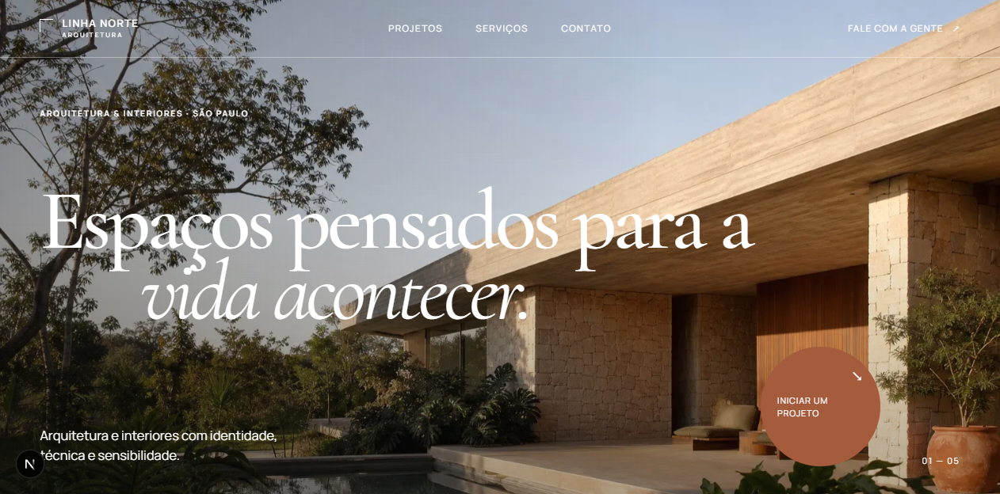

# Linha Norte Arquitetura

Landing page conceitual para um escritório fictício de arquitetura e interiores. O projeto combina direção de arte editorial, imagens arquitetônicas autorais e uma experiência responsiva voltada à apresentação de portfólio e à captação de novos projetos.



## Site

**Produção:** [linhanorte-arquitetura.vercel.app](https://linhanorte-arquitetura.vercel.app)

## Sobre o projeto

A interface foi inspirada no ritmo visual de revistas de arquitetura: tipografia serifada de alto contraste, composição assimétrica, grandes áreas de respiro e uma paleta de areia, concreto, terracota e verde-oliva.

O conteúdo apresenta:

- hero com chamada principal e CTA;
- manifesto conceitual do escritório;
- galeria editorial com cinco projetos fictícios;
- serviços organizados em uma composição vertical;
- linha do tempo do processo de trabalho;
- formulário integrado ao WhatsApp;
- perguntas frequentes e contatos.

## Tecnologias

- Next.js 16
- React 19
- TypeScript
- CSS responsivo
- Vercel

## Recursos de experiência

- layout mobile-first;
- animações de revelação com `IntersectionObserver`;
- parallax discreto nas imagens;
- suporte a `prefers-reduced-motion`;
- navegação por âncoras;
- formulário que monta uma mensagem e abre o WhatsApp;
- metadados Open Graph e imagem social dedicada.

## Como executar

Pré-requisitos: Node.js 20.9 ou superior.

```bash
npm install
npm run dev
```

Acesse [http://localhost:3000](http://localhost:3000).

## Scripts

```bash
npm run dev    # ambiente de desenvolvimento
npm run build  # build de produção
npm run start  # servidor de produção
npm run lint   # análise estática
```

## Estrutura principal

```text
app/
├── globals.css    # sistema visual e responsividade
├── layout.tsx     # fontes e metadados
└── page.tsx       # conteúdo, interações e formulário

docs/
└── preview.png    # captura usada neste README

public/
├── images/        # imagens dos projetos
└── og.png         # imagem para compartilhamento
```

## Observação

Linha Norte Arquitetura é uma marca fictícia criada para fins de portfólio. Os projetos, endereços e contatos apresentados no site são conceituais.
